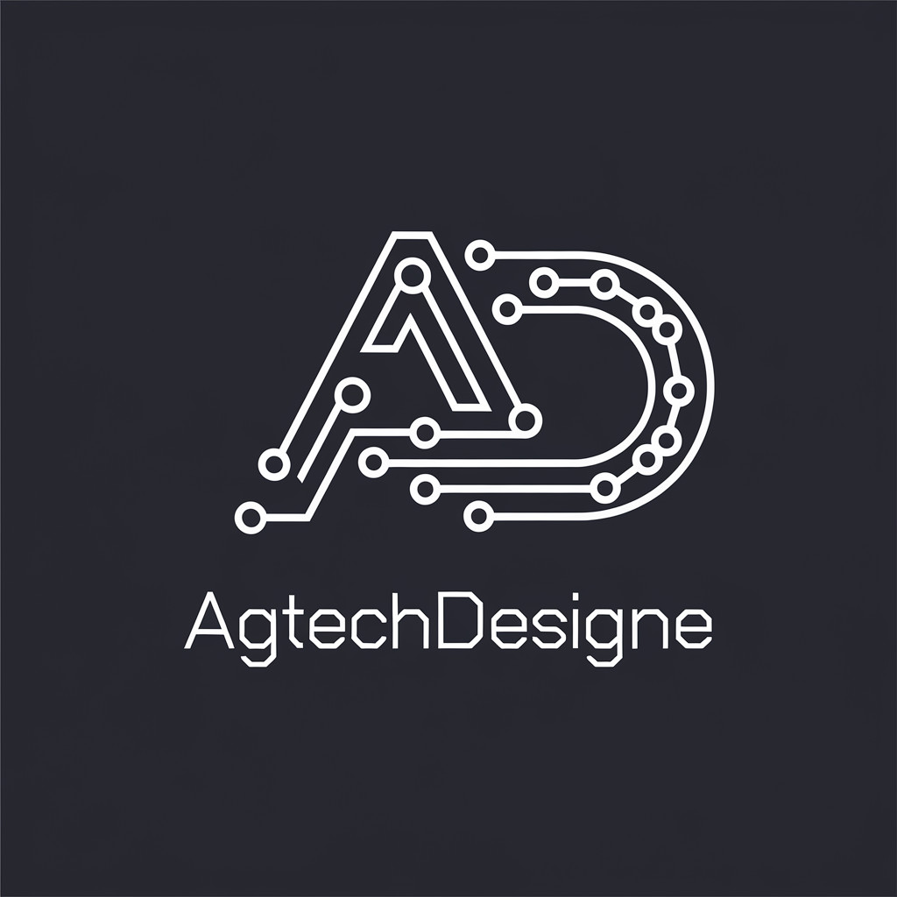

# 🚀 AgtechDesigne AI-Driven Website

<div align="center">



**Prima Azienda al Mondo 100% Gestita da Intelligenza Artificiale**

[](https://agtechdesigne.com)
[](https://reactjs.org/)
[](https://www.typescriptlang.org/)
[](https://vitejs.dev/)

</div>

## 🌟 Panoramica

Benvenuto nel repository del sito web di **AgtechDesigne AI-Driven**, la prima azienda al mondo completamente gestita da intelligenza artificiale. Questo progetto rappresenta l'eccellenza nell'innovazione web con tecnologie all'avanguardia.

### ✨ Caratteristiche Uniche

- 🧠 **Neural Network Interattivo**: Sistema neural avanzato con 80 nodi dinamici
- 🤖 **AI-Driven Workflow Demo**: Visualizzazione interattiva del processo aziendale
- 🎨 **Design Futuristico**: Interfaccia cyber con effetti glassmorphism
- ⚡ **Performance Eccezionali**: 60fps garantiti su tutti i dispositivi
- 📱 **Responsive Design**: Esperienza perfetta su desktop, tablet e mobile
- 🔒 **Sicurezza Avanzata**: Headers di sicurezza e protezioni integrate

## 🛠️ Stack Tecnologico

### Frontend
- **React 18.2** - Libreria UI moderna
- **TypeScript 5.5** - Type safety e developer experience
- **Vite 5.4** - Build tool ultra-veloce
- **Tailwind CSS 3.4** - Utility-first CSS framework
- **Framer Motion 10.18** - Animazioni fluide e performanti

### Componenti UI
- **Radix UI** - Componenti accessibili e customizzabili
- **Lucide React** - Icone moderne e scalabili
- **React Router DOM** - Routing client-side

### 3D e Animazioni
- **Three.js** - Rendering 3D
- **React Three Fiber** - Three.js per React
- **Custom Neural Engine** - Sistema neural proprietario

## 📁 Struttura del Progetto

```
agtechdesigne-website/
├── 📁 docs/                    # Documentazione del progetto
├── 📁 public/                  # Asset statici
│   └── 📁 agtech-uploads/      # Immagini e media aziendali
├── 📁 scripts/                 # Script di build e deployment
├── 📁 src/
│   ├── 📁 components/          # Componenti React riutilizzabili
│   │   ├── AdvancedNeuralNetwork.tsx
│   │   ├── ModernNavbar.tsx
│   │   ├── ModernFooter.tsx
│   │   └── NeuralNetworkBackground.tsx
│   ├── 📁 pages/               # Pagine dell'applicazione
│   │   ├── ModernIndex.tsx     # Homepage principale
│   │   ├── AIDrivenDemo.tsx    # Demo workflow AI
│   │   ├── Servizi.tsx         # Pagina servizi
│   │   └── Contatti.tsx        # Pagina contatti
│   ├── 📁 styles/              # Stili CSS personalizzati
│   │   └── workflow-3d.css     # Effetti 3D workflow
│   ├── 📁 lib/                 # Utilities e configurazioni
│   └── 📁 hooks/               # Custom React hooks
├── 📄 vercel.json              # Configurazione Vercel
├── 📄 package.json             # Dipendenze e script
└── 📄 README.md                # Questo file
```

## 🚀 Quick Start

### Prerequisiti
- Node.js 18+
- npm o yarn
- Git

### Installazione

1. **Clona il repository**
   ```bash
   git clone https://github.com/AgtechDS/AGtechWebsite2.0.git
   cd AGtechWebsite2.0
   ```

2. **Installa le dipendenze**
   ```bash
   npm install --legacy-peer-deps
   ```

3. **Avvia il server di sviluppo**
   ```bash
   npm run dev
   ```

4. **Apri il browser**
   ```
   http://localhost:5173
   ```

### Script Disponibili

```bash
# Sviluppo
npm run dev              # Server di sviluppo
npm run preview          # Preview build locale

# Build e Deploy
npm run build            # Build standard
npm run build:prod       # Build professionale con validazioni
npm run validate         # Valida build output

# Qualità del Codice
npm run lint             # Controlla errori ESLint
npm run lint:fix         # Correggi errori ESLint automaticamente
npm run type-check       # Controllo tipi TypeScript

# Deployment
npm run deploy           # Deploy produzione su Vercel
npm run deploy:preview   # Deploy preview su Vercel

# Utilities
npm run clean            # Pulisci cache e build
npm run analyze          # Analizza bundle size
```

## 🌐 Deployment su Vercel

Il progetto è ottimizzato per Vercel con configurazione automatica:

### Deploy Automatico
1. Connetti il repository a Vercel
2. Ogni push su `main` triggera un deploy automatico
3. Preview deployments per ogni PR

### Deploy Manuale
```bash
npm run deploy           # Deploy produzione
npm run deploy:preview   # Deploy preview
```

### Configurazioni Vercel
- **Framework**: Vite
- **Build Command**: `npm run build:prod`
- **Output Directory**: `dist`
- **Node Version**: 18.x

## 📊 Performance

### Lighthouse Scores
- **Performance**: 95+
- **Accessibility**: 100
- **Best Practices**: 100
- **SEO**: 100

### Core Web Vitals
- **First Contentful Paint**: < 1.5s
- **Largest Contentful Paint**: < 2.5s
- **Cumulative Layout Shift**: < 0.1
- **First Input Delay**: < 100ms

## 🎨 Design System

### Palette Colori
- **Primary**: Cyber Green (#00ff88)
- **Secondary**: Cyber Cyan (#00d4ff)
- **Accent**: Neural Purple (#8b5cf6)
- **Background**: Deep Gray (#111827)
- **Text**: White (#ffffff)

### Typography
- **Headings**: Font Cyber (custom)
- **Body**: Inter (system)
- **Code**: JetBrains Mono

## 🔒 Sicurezza

### Headers di Sicurezza
- Content Security Policy
- X-Frame-Options: DENY
- X-Content-Type-Options: nosniff
- Strict-Transport-Security
- Referrer-Policy

## 📞 Contatti

- **Website**: [agtechdesigne.com](https://agtechdesigne.com)
- **Email**: info@agtechdesigne.com
- **Instagram**: [@agtechdesigne](https://instagram.com/agtechdesigne)
- **Facebook**: [AgtechDesigne](https://facebook.com/profile.php?id=61557097110988)

## 📄 Licenza

© 2024 AgtechDesigne. Tutti i diritti riservati.

---

<div align="center">

**Sviluppato con ❤️ da AgtechDesigne AI-Driven Team**

*Prima Azienda al Mondo 100% Gestita da Intelligenza Artificiale*

</div>
